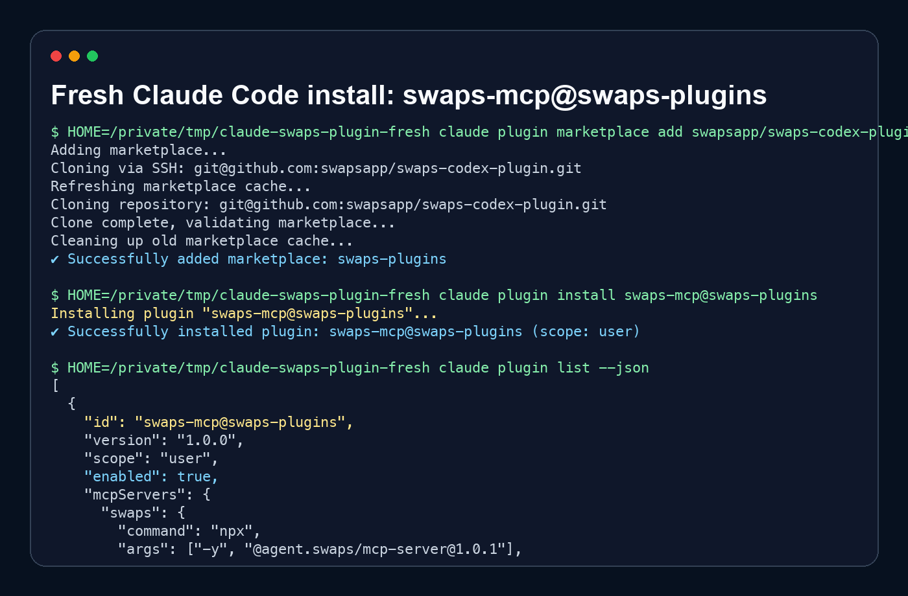

# Swaps MCP Plugin

Model Context Protocol server for Swaps, the agent-native crypto on-ramp aggregator.

This repository packages [`@agent.swaps/mcp-server@1.0.1`](https://www.npmjs.com/package/@agent.swaps/mcp-server) as a marketplace-ready plugin for Claude Code and MCP-compatible developer tools. It adds live Swaps quote, provider taxonomy, route explanation, and corridor tools without an API key.

Swaps operates through licensed local partners while pursuing its own VASP/MSB license.

## Install

### Claude Code

Claude Code uses marketplace repositories. Add this marketplace, then install the plugin:

```text
/plugin marketplace add swapsapp/swaps-codex-plugin
/plugin install swaps-mcp@swaps-plugins
```

CLI equivalent:

```bash
claude plugin marketplace add swapsapp/swaps-codex-plugin
claude plugin install swaps-mcp@swaps-plugins
```

If your Claude Code build exposes a shortcut named `/plugin add`, use the same repository target:

```text
/plugin add swapsapp/swaps-codex-plugin
```

### Cursor

Add this to `.cursor/mcp.json`:

```json
{
  "mcpServers": {
    "swaps": {
      "command": "npx",
      "args": ["-y", "@agent.swaps/mcp-server@1.0.1"],
      "env": {
        "SWAPS_MCP_VERSION": "1.0.1"
      }
    }
  }
}
```

### Claude Desktop

Add this to `~/Library/Application Support/Claude/claude_desktop_config.json` on macOS:

```json
{
  "mcpServers": {
    "swaps": {
      "command": "npx",
      "args": ["-y", "@agent.swaps/mcp-server@1.0.1"],
      "env": {
        "SWAPS_MCP_VERSION": "1.0.1"
      }
    }
  }
}
```

### Windsurf

Add this to `~/.codeium/windsurf/mcp_config.json`:

```json
{
  "mcpServers": {
    "swaps": {
      "command": "npx",
      "args": ["-y", "@agent.swaps/mcp-server@1.0.1"],
      "env": {
        "SWAPS_MCP_VERSION": "1.0.1"
      }
    }
  }
}
```

### Codex

Codex local plugin metadata is included for compatibility. A public Codex marketplace submission path was not available in the public docs at publish time, so distribution starts with this GitHub repository and the MCP config above.

## Try It Now



Paste this into your MCP host after installing:

```text
Use the swaps_quote tool to find the cheapest way to buy 100 USD of BTC in the United States with card. Then explain why the winner beat the alternatives using the inline explain field.
```

Expected behavior: the agent calls `swaps_quote`, returns a live provider winner, shows estimated output, fees, checkout URL, and explains the routing choice from the returned `winner.explain` payload.

## Tools

### `swaps_quote`

Gets a live fiat on-ramp or off-ramp quote across Swaps providers. It returns the winning provider, ranked alternatives, fees, estimated output, checkout URL, and inline `LLMExplainPayload`.

Example prompt:

```text
Use swaps_quote to find the best way to buy 100 USD of BTC in the US with card.
```

### `swaps_taxonomy`

Returns the 6-axis provider taxonomy for Swaps providers: domain, flow shape, integration style, settlement rail, user constraints, and agentic exposure.

Example prompt:

```text
Use swaps_taxonomy and summarize which providers are fiat ramps versus crypto swap providers.
```

### `swaps_providers_for_corridor`

Filters provider candidates for a country and optional payment method. Use this before quoting when the user asks which providers may fit a corridor.

Example prompt:

```text
Use swaps_providers_for_corridor for US card and show candidate fiat-ramp providers.
```

### `swaps_explain_choice`

Fetches a cached post-hoc explanation for a prior `quoteId`. Prefer the inline `winner.explain` field from `swaps_quote`; the post-hoc cache may expire or be isolate-scoped.

Example prompt:

```text
Use swaps_explain_choice for this quoteId and explain why that provider won.
```

### `swaps_corridors`

Returns curated buy and sell corridors with preferred provider ordering. Use it for broad route-planning questions before requesting live pricing.

Example prompt:

```text
Use swaps_corridors to show the preferred providers for top BTC and ETH buy corridors.
```

## Live Endpoints

- OpenAPI: https://agent.swaps.app/openapi.json
- Taxonomy: https://agent.swaps.app/taxonomy.json
- Live quote: https://agent.swaps.app/llm/quote
- Routing explainer: https://agent.swaps.app/llm/routing-explainer

Canonical developer page: https://www.swaps.app/developers/skills/mcp-server

Underlying server source: https://github.com/swapsapp/swaps-mcp-server

## No API Key

The MCP server is anonymous-callable and requires no API key. Upstream rate limits apply.

## Distribution Status

- Claude Code marketplace repository: ready in this repo.
- Codex marketplace: no public submission path found; local `.codex-plugin` metadata is included.
- GitHub Actions smoke workflow: founder TODO; initial publish token lacks GitHub `workflow` scope.
- Cursor Hub: founder TODO if account submission is required.
- Glama: founder TODO if account submission is required.
- Smithery: founder TODO if account submission is required.

## Development

Run the smoke test:

```bash
npm install
npm run smoke
```

The smoke test performs an MCP handshake, lists all tools, calls `swaps_taxonomy`, and calls `swaps_quote` for `100 USD -> BTC`, `US`, `card`.

## License

MIT. See [LICENSE](LICENSE).
